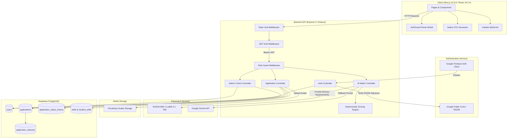
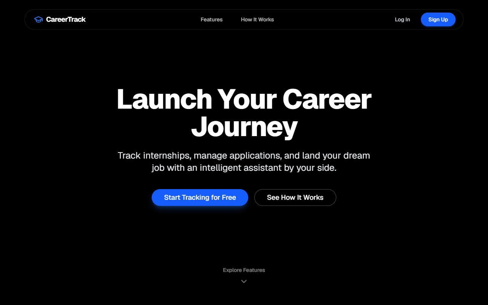
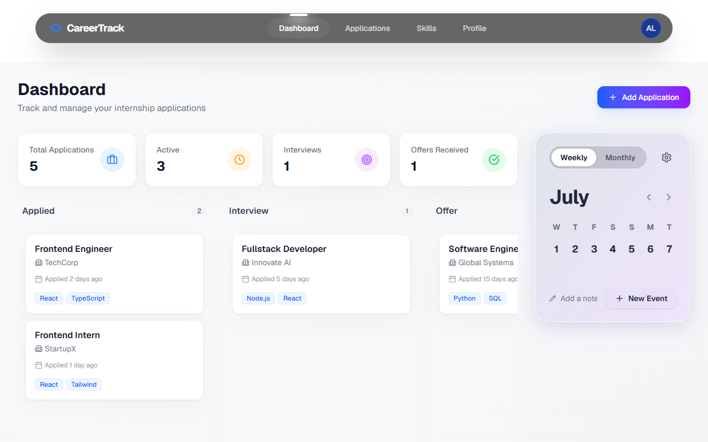
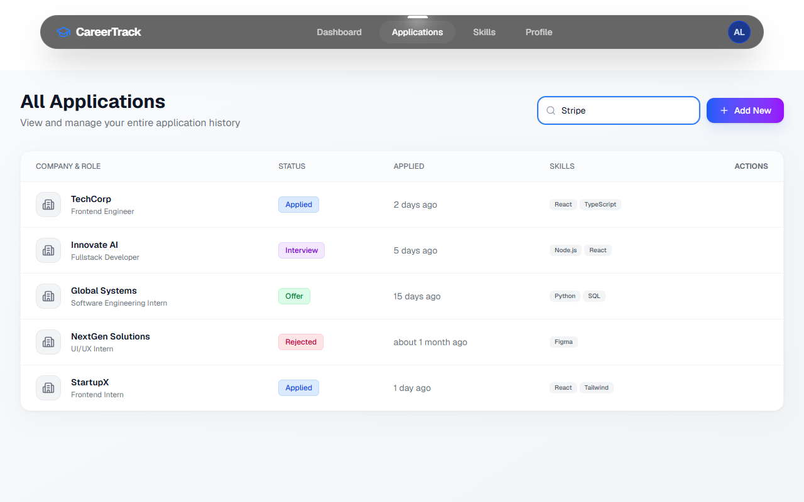
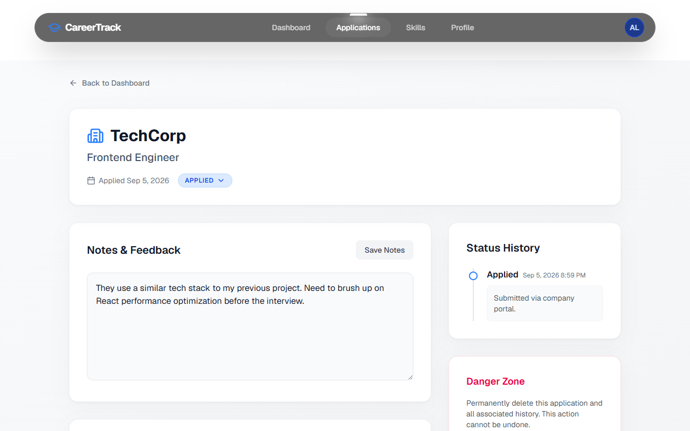
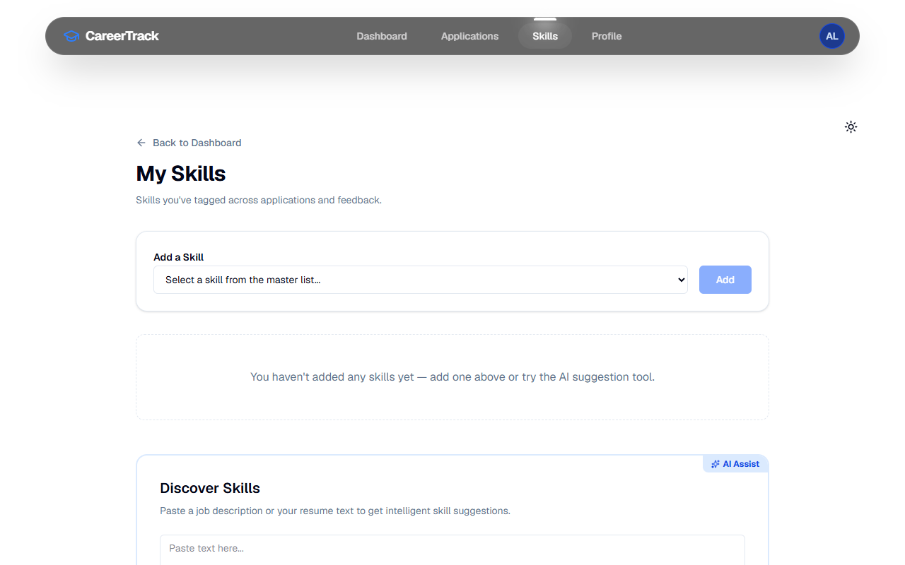
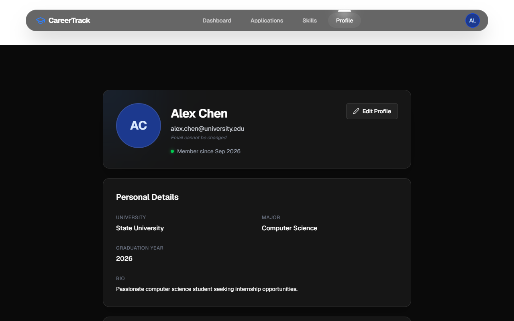
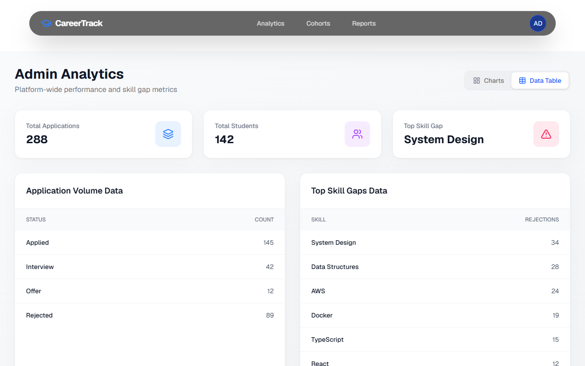
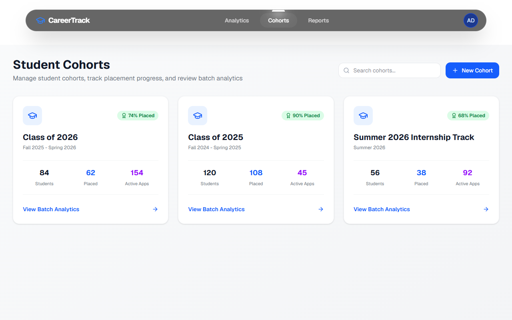
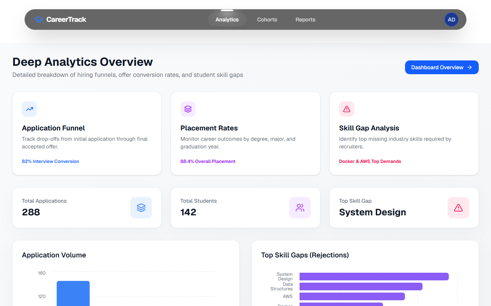

# CareerTrack – Student Career & Internship Tracker

CareerTrack is a full-stack career and internship management platform designed for higher education students and university career administrators. It streamlines the student job hunt with an interactive Kanban application pipeline, student skills tracking, conversion analytics, dynamic milestone calendars, zero-dependency CSV exports, live admin cohort metrics, and hybrid AI resume/job alignment.

---

## Table of Contents

- [Overview](#overview)
- [Key Features](#key-features)
- [Technology Stack](#technology-stack)
- [System Architecture](#system-architecture)
- [Project Structure](#project-structure)
- [Authentication & Security](#authentication--security)
- [AI Resume Matching](#ai-resume-matching)
- [Analytics & Cohorts](#analytics--cohorts)
- [Milestone Calendar](#milestone-calendar)
- [CSV Export](#csv-export)
- [Testing](#testing)
- [Screenshots](#screenshots)
- [Local Setup](#local-setup)
- [Environment Variables](#environment-variables)
- [Running Tests](#running-tests)
- [Current Limitations](#current-limitations)
- [Future Improvements](#future-improvements)
- [What I Learned](#what-i-learned)
- [Author](#author)

---

## Overview

Applying for internships and tracking job applications is frequently chaotic for students, relying on disorganized spreadsheets, lost emails, and unmeasured skill gaps. Simultaneously, career services administrators lack real-time visibility into student outcomes, cohort placement rates, and skill marketability.

**CareerTrack** solves this problem by providing:
1. **For Students:** A central workspace to organize applications across hiring stages, analyze which technical skills yield interviews, track application history, and benchmark their resume against target job descriptions.
2. **For Administrators:** Real-time cohort analytics, institutional placement metrics, application funnels, and data export tools powered by live PostgreSQL data.

---

## Key Features

### Student Experience
- **Internship & Application Tracking:** Create, edit, and soft-delete applications with role title, company name, submission dates, notes, and tagged skills.
- **Drag-and-Drop Kanban Pipeline:** Interactive application board powered by `@dnd-kit` with columns: `Applied`, `Interview`, `Offer`, and `Rejected`. Status changes update the database and trigger automatic history logging.
- **Application Lifecycle & History:** Chronological audit log (`application_status_history`) tracking each status transition timestamp and associated notes.
- **Student Skills Portfolio:** Track technical competencies categorized by domain (Programming, Databases, Web, Cloud) with self-rated proficiency levels (`beginner`, `intermediate`, `advanced`).
- **Skill Conversion Analytics:** Real-time metrics calculating how individual skills convert through application stages to interviews and offers.
- **Hybrid AI Resume / Job Matching:** Dual-stage alignment system that parses job requirements and compares candidate profiles using deterministic scoring.
- **Dynamic Milestone Calendar:** Calendar widget on the student dashboard that aggregates real application submission dates and flags milestones by month and day.
- **CSV Data Export:** One-click download of all student applications into a standardized CSV file using native browser APIs.
- **Profile & Avatar Management:** Manage student profile details (university, major, graduation year, bio) with custom avatar uploads via Cloudinary.

### Administrator Experience
- **Institutional Dashboard:** High-level platform KPIs including total registered students, active applications, offers secured, interview rates, and placement rates.
- **Live Cohort Analytics:** Dynamic grouping of students by graduation year and major to calculate real cohort size, applications per student, placed students, and placement percentage directly from PostgreSQL.
- **Interactive Funnel & Trend Charts:** Visual breakdown of institutional application progress and stage distributions using Recharts.
- **Admin CSV Export:** Download platform analytics, stage distributions, and skill conversion rates into a structured CSV report.
- **Role-Based Authorization:** Secure route and API isolation ensuring administrative endpoints and screens are accessible only to verified admin accounts.

---

## Technology Stack

| Layer | Technologies |
|---|---|
| **Frontend** | Next.js 16.3.6 (App Router), React 19.2.4, TypeScript, Tailwind CSS v4, Framer Motion, Recharts, `@dnd-kit`, Lucide React |
| **Backend** | Node.js (>= 18), Express 5, CORS, Multer, `express-rate-limit` |
| **Database** | Supabase PostgreSQL (Foreign key constraints, CASCADE deletes, JSON aggregations, indexing) |
| **Authentication** | Dual-layer: Native bcrypt (10 rounds) + CareerTrack JWT, and Google Sign-In via Firebase Auth token verification (RS256) |
| **AI / APIs** | NVIDIA NIM API (`meta/llama-3.1-70b-instruct`) or Google Gemini API (structured extraction) |
| **Cloud & Media** | Cloudinary (avatar image uploads), Supabase Cloud (hosted PostgreSQL) |
| **Testing** | Node.js built-in test runner (`node:test`, `node:assert`), Playwright Core E2E |

---

## System Architecture



---

## Project Structure

```text
Student-Career-and-Internship-Tracker/
├── backend/
│   ├── src/
│   │   ├── app.js                      # Express application setup and middleware
│   │   ├── config/
│   │   │   ├── cloudinary.js           # Cloudinary SDK initialization
│   │   │   └── supabase.js             # Supabase client connection pool
│   │   ├── controllers/
│   │   │   ├── adminController.js       # Admin platform & cohort aggregation
│   │   │   ├── aiMatchController.js     # AI extraction & deterministic scoring
│   │   │   ├── applicationController.js # Application CRUD & status history
│   │   │   ├── authController.js        # Registration, login, Google token auth
│   │   │   ├── skillController.js       # Skills taxonomy & conversion rates
│   │   │   ├── skillSuggestionController.js # AI-assisted skill suggestions
│   │   │   ├── studentProfileController.js  # Profile management & avatar upload
│   │   │   └── studentSkillsController.js   # Student skills portfolio
│   │   ├── middleware/
│   │   │   ├── auth.js                  # JWT token verification middleware
│   │   │   ├── rateLimiters.js          # API rate limiting middleware
│   │   │   └── requireRole.js           # Role-based access control (student/admin)
│   │   ├── routes/
│   │   │   ├── adminRoutes.js           # /api/v1/admin endpoints
│   │   │   ├── applicationRoutes.js     # /api/v1/applications endpoints
│   │   │   ├── authRoutes.js            # /api/v1/auth endpoints
│   │   │   ├── skillRoutes.js           # /api/v1/skills endpoints
│   │   │   └── studentRoutes.js         # /api/v1/students endpoints
│   │   └── utils/
│   │       └── verifyGoogleToken.js     # Google RS256 cert verification utility
│   ├── scripts/
│   │   └── createAdmin.js              # Secure CLI admin bootstrap script
│   ├── tests/
│   │   ├── helpers/
│   │   │   └── mockHttp.js              # Mock Express request/response helpers
│   │   ├── applications.test.js         # Application workflow & lifecycle tests
│   │   ├── auth.test.js                 # Authentication & authorization test suite
│   │   ├── cohorts.test.js              # Cohort aggregation & route security tests
│   │   ├── createAdmin.test.js          # Admin bootstrap CLI validation tests
│   │   ├── rateLimit.test.js            # Auth & AI rate limiting test suite
│   │   └── scoring.test.js              # Deterministic resume/job scoring tests
│   ├── package.json
│   ├── server.js                        # HTTP server entry point
│   └── .env.example
├── client/
│   ├── src/
│   │   ├── app/
│   │   │   ├── (auth)/                  # Login and registration pages
│   │   │   ├── admin/                   # Admin portal (dashboard, cohorts, analytics)
│   │   │   ├── student/                 # Student portal (dashboard, apps, skills, match)
│   │   │   ├── layout.tsx               # Root layout and theme provider
│   │   │   └── page.tsx                 # Public landing page
│   │   ├── components/
│   │   │   ├── admin/                   # Admin charts, metric cards, cohort tables
│   │   │   ├── auth/
│   │   │   │   └── auth-guard.tsx       # Client-side route & session guard
│   │   │   ├── dashboard/               # Kanban board, stat strip, calendar widget
│   │   │   ├── navbar.tsx               # Responsive role-aware navigation bar
│   │   │   └── ui/                      # Shared UI components
│   │   └── lib/
│   │       ├── api.ts                   # Centralized API fetch wrapper
│   │       ├── export-utils.ts          # Zero-dependency browser CSV export engine
│   │       ├── firebase.ts              # Firebase client SDK initialization
│   │       ├── supabase.ts              # Supabase browser client
│   │       └── types.ts                 # Shared TypeScript interfaces
│   ├── test-results/
│   │   ├── screenshots/                 # E2E test run screenshots
│   │   └── summary.json                 # Playwright test execution summary
│   ├── playwright_e2e_test.js           # Playwright E2E browser test script
│   └── package.json
├── database/
│   ├── migrations/                      # Incremental SQL migration scripts
│   ├── schema.sql                       # Core PostgreSQL database schema
│   └── supabase_schema.sql              # Supabase schema with seed data & indexes
└── README.md
```

---

## Authentication & Security

CareerTrack implements defense-in-depth security across client and server layers:

1. **Bcrypt Password Hashing:** User passwords are salted and hashed with `bcrypt` (10 rounds) prior to database persistence. Plaintext passwords are never stored.
2. **Stateless JWT Authentication:** Authenticated user sessions issue signed CareerTrack JWTs. All protected API endpoints pass through `authenticate` middleware, requiring an `Authorization: Bearer <token>` header and verifying `{ userId, role }`.
3. **Cryptographic Google Token Verification (`verifyGoogleToken.js`):** Client-side Google Sign-In issues a Firebase ID token. The backend verifies the token directly against Google's public signing certificates via RS256 signature verification, caching certificates dynamically according to `Cache-Control: max-age` and strictly validating token algorithm, expiration, project audience, and issuer.
4. **Role-Based Access Control (RBAC):** Backend endpoints enforce strict role separation using `requireRole('admin')` middleware. Unauthorized role attempts receive immediate `403 Forbidden` responses.
5. **Student Ownership Isolation:** Backend controllers strictly enforce student tenant isolation at the query layer by scoping all student record access with `.eq('student_id', userId)`.
   > **Note on PostgreSQL Row-Level Security (RLS):** Because backend services connect using Supabase service-role credentials to execute administrative, aggregation, and operational queries, requests bypass PostgreSQL RLS policies. Multi-tenant isolation and ownership checks are therefore strictly enforced at the application controller level.
6. **Frontend AuthGuard:** Client-side routes under `/student/*` and `/admin/*` are shielded by `<AuthGuard allowedRole="...">`, decoding token expiration and validating permissions before rendering protected layouts.
7. **API Rate Limiting (`express-rate-limit`):**
   - **Authentication Endpoints:** `/api/v1/auth/register`, `/api/v1/auth/login`, and `/api/v1/auth/google` are throttled to a maximum of **10 attempts per IP address per 15-minute window** to mitigate brute-force and credential-stuffing attacks. Requests exceeding the threshold receive a `429 Too Many Requests` response with standard `RateLimit-*` headers.
   - **AI Resume Matching:** `/api/v1/students/me/resume-match` is restricted to **10 requests per authenticated student per hour** (keyed by authenticated student ID) to protect external AI provider quotas from runaway usage.
   - *(Note: Application-level rate limiting protects against credential brute-forcing and quota exhaustion; it does not replace edge-layer DDoS mitigation or web application firewalls.)*
8. **Secure Environment-Driven Admin Bootstrap:** Initial administrators are created on-demand via `npm run create-admin` using runtime environment variables (`ADMIN_EMAIL`, `ADMIN_PASSWORD`). No default administrator accounts or preset passwords exist in database seed files or code.

---

## AI Resume Matching

CareerTrack utilizes a **hybrid architecture** that combines large language models with deterministic scoring algorithms:

```text
[Raw Job Description] ───┐
                         ├──► [LLM Entity Extraction] ──► [Extracted JSON Specs] ──┐
[Student Resume / Bio] ──┘      (NVIDIA NIM / Gemini)                              │
                                                                                   ▼
                                                                     [Deterministic Scoring Engine]
                                                                      - Mandatory Skills: 45 pts
                                                                      - Preferred Skills: 25 pts
                                                                      - Experience Level: 20 pts
                                                                      - Education Match:  10 pts
                                                                                   │
                                                                                   ▼
                                                                     [Auditable Score (0-100%)]
                                                                     + Matched / Missing Breakdown
```

### Key Principles:
- **LLM for Extraction Only:** The LLM (NVIDIA NIM LLaMA 3.1 70B or Google Gemini) is used exclusively to parse unstructured text into structured JSON (skills, years of experience, degree level).
- **No Locally Trained Model:** CareerTrack does not use a black-box local ML model. Scoring is 100% auditable and reproducible.
- **Deterministic 100-Point Scoring Rubric:**
  - **Mandatory Skills (45 Points):** Proportional score based on the percentage of required skills matched:  
    $$\text{Score} = \text{round}\left(\frac{\text{matched mandatory}}{\text{total mandatory}} \times 45\right)$$
  - **Preferred Skills (25 Points):** Proportional score based on bonus/preferred skills matched:  
    $$\text{Score} = \text{round}\left(\frac{\text{matched preferred}}{\text{total preferred}} \times 25\right)$$
  - **Experience Level (20 Points):** Linear scaling up to the required years:  
    $$\text{Score} = \min\left(20, \text{round}\left(\frac{\text{candidate years}}{\text{required years}} \times 20\right)\right)$$
  - **Education Level (10 Points):** Evaluated against a hierarchical degree ladder (`None < High School < Associate < Bachelor < Master < PhD`). Exact match or higher awards 10 points; one level below awards 6 points; two or more levels below awards 3 points.
  - **Total Score:** Clamped strictly between 0 and 100 points.

---

## Analytics & Cohorts

CareerTrack powers all student and administrative analytics directly from live PostgreSQL database queries:

### Student Analytics
- **Personal Conversion Funnel:** Tracks how many applications move from `Applied` to `Interview` and `Offer`.
- **Skill-to-Offer Conversion:** Evaluates which skills tagged in applications have the highest interview and offer conversion percentages.

### Administrator & Cohort Analytics
- **System KPIs:** Live counts of registered students, total applications submitted, total offers received, overall interview rate, and institutional placement rate.
- **Database Cohort Aggregation (`calculateCohortsMetrics`):**
  - Aggregates students dynamically by `graduation_year` and `major`.
  - Computes cohort size, active applicants, total applications, and unique placed students (deduplicating multiple offers so placed counts never exceed cohort size).
  - Handles edge cases safely (zero students, empty cohorts, unassigned graduation years).

---

## Milestone Calendar

The Student Dashboard includes a dynamic, data-driven calendar widget:

- **Real Data Integration:** Directly consumes the student's active application records (`date_applied`).
- **Milestone Grouping:** Groups application submissions by day and month, displaying company names and status badges.
- **Accurate Scope:** Current milestones represent real application submission dates. *(Note: Dedicated interview scheduling and calendar reminder dates are not currently stored as separate database fields; see [Current Limitations](#current-limitations)).*

---

## CSV Export

CareerTrack provides zero-dependency, client-side CSV exports implemented in [`export-utils.ts`](file:///d:/Mern-stack/DevTools/project/Student-Career-and-Internship-Tracker/client/src/lib/export-utils.ts):

- **Zero External Libraries:** Built using native browser APIs (`Blob`, `URL.createObjectURL`, and programmatic download links).
- **RFC 4180 Compliant:** Handles string escaping, quotes, commas, and multiline notes properly.
- **Student Applications Export:**
  - Exported from the Student Applications page.
  - File format: `careertrack_applications_YYYY-MM-DD.csv`.
  - Fields: Application ID, Company, Role Title, Status, Date Applied, Skills Tagged, Notes, Created At.
- **Admin Institutional Analytics Export:**
  - Exported from the Admin Analytics page.
  - File format: `careertrack_admin_analytics_YYYY-MM-DD.csv`.
  - Sections: Platform Summary KPIs, Application Funnel Breakdown, Status Distribution, and Skill Conversion Rates.

---

## Testing

CareerTrack maintains automated test suites covering core business logic, API security, and end-to-end user workflows.

### 1. Backend Automated Tests (Node.js Built-in Runner)
- **Framework:** Node.js native `node:test` and `node:assert` (0 external test dependencies).
- **Execution:** Offline execution with mocked Supabase query builders; **zero mutation of production database data**.
- **Current Status:** **78 / 78 passing** across test suites:
  1. `applications.test.js`: Input validation, status transition lifecycle, student ownership isolation, and soft deletion.
  2. `auth.test.js`: Registration validation, login validation, Google RS256 token verification, JWT middleware, and RBAC enforcement.
  3. `cohorts.test.js`: Pure cohort aggregation algorithm, division-by-zero protection, offer deduplication, and admin route protection.
  4. `scoring.test.js`: Skill normalization, alias mapping, degree hierarchy ranking, experience caps, 0%/100% boundary testing, and missing-input safety.
  5. `rateLimit.test.js`: Authentication rate limiting (10 attempts / 15m), AI resume matching rate limiting (10 requests / hr per student), and standard header validation.
  6. `createAdmin.test.js`: Secure admin bootstrap validation, environment parsing, bcrypt password hashing, and duplicate handling.

### 2. End-to-End Tests (Playwright)
- **Script:** [`client/playwright_e2e_test.js`](file:///d:/Mern-stack/DevTools/project/Student-Career-and-Internship-Tracker/client/playwright_e2e_test.js)
- **Scope:** 26 test scenarios covering 12 distinct views (Landing page, Auth flows, Student Dashboard, Applications List, Application Detail, Skills Tracker, Profile, Admin Dashboard, Admin Cohorts, Admin Analytics, and Theme Toggle).
- **Current Live Baseline:** **26 / 26 passing** (100% current E2E baseline) across all critical user and administrative journeys on the live application.

---

## Screenshots

Representative screenshots captured during Playwright browser verification:

| View | Screenshot |
|---|---|
| **Landing Page** |  |
| **Student Dashboard & Kanban** |  |
| **Applications Management** |  |
| **Application Detail & Timeline** |  |
| **Skills Tracker & Analytics** |  |
| **Student Profile** |  |
| **Admin Dashboard** |  |
| **Live Cohort Analytics** |  |
| **Deep Admin Analytics** |  |

---

## Local Setup

### Prerequisites
- **Node.js:** v18.0.0 or higher
- **npm:** v9.0.0 or higher
- **Supabase Account:** (or a local PostgreSQL instance with schema applied)

### 1. Clone the Repository
```bash
git clone https://github.com/rimzy2002/Student-Career-and-Internship-Tracker.git
cd Student-Career-and-Internship-Tracker
```

### 2. Database Initialization
1. In your Supabase project dashboard, navigate to the **SQL Editor**.
2. Run [`database/supabase_schema.sql`](file:///d:/Mern-stack/DevTools/project/Student-Career-and-Internship-Tracker/database/supabase_schema.sql) to create all tables, junction tables, foreign keys, and default status seeds.

### 3. Backend Setup
```bash
cd backend
npm install

# Create environment configuration
cp .env.example .env
# Edit .env and supply your Supabase and JWT credentials

# Start development server
npm run dev
```
The backend server runs on `http://localhost:5000`.

### 4. Create Initial Admin Account
CareerTrack does not ship with default admin credentials or insecure database seeds. Create the initial administrator on-demand via the CLI bootstrap script:

```bash
cd backend
ADMIN_EMAIL="admin@yourinstitution.edu" ADMIN_PASSWORD="your-secure-password" npm run create-admin
```

Optional configuration variables:
- `ADMIN_FIRST_NAME`: Administrator first name (default: `"System"`)
- `ADMIN_LAST_NAME`: Administrator last name (default: `"Admin"`)

Key characteristics:
- Passwords are salted and hashed with `bcrypt` (10 salt rounds) prior to database insertion.
- No default administrator password exists in the repository.
- Admin creation is manual and on-demand.
- If the email already exists, duplicate creation is handled safely without overwriting data.

### 5. Frontend Setup
```bash
cd ../client
npm install

# Create local environment configuration (.env.local)
# Set NEXT_PUBLIC_API_URL=http://localhost:5000
# Set NEXT_PUBLIC_SUPABASE_URL and NEXT_PUBLIC_SUPABASE_ANON_KEY

# Start development server
npm run dev
```
The client application runs on `http://localhost:3000`.

---

## Environment Variables

### Backend Configuration (`backend/.env`)

| Variable Name | Required | Description |
|---|---|---|
| `PORT` | Yes | Backend HTTP server port (e.g., `5000`) |
| `NODE_ENV` | Yes | Environment mode (`development` or `production`) |
| `SUPABASE_URL` | Yes | Supabase project URL |
| `SUPABASE_SECRET_KEY` | Yes | Supabase Service Role Secret Key (for server operations) |
| `SUPABASE_PUBLISHABLE_KEY` | Yes | Supabase Anon Publishable Key |
| `JWT_SECRET` | Yes | Secret key used to sign and verify CareerTrack JWTs |
| `JWT_EXPIRES_IN` | Yes | Token lifespan (e.g., `1d` or `7d`) |
| `FRONTEND_ORIGIN` | Yes | Allowed CORS origin (e.g., `http://localhost:3000`) |
| `FIREBASE_PROJECT_ID` | Yes | Firebase project ID for Google token RS256 verification |
| `GEMINI_API_KEY` | Optional* | Google Gemini API key for structured extraction |
| `NVIDIA_API_KEY` | Optional* | NVIDIA NIM API key for structured extraction |
| `NVIDIA_MODEL` | Optional | Model identifier (defaults to `meta/llama-3.1-70b-instruct`) |
| `AI_PROVIDER` | Optional | Explicit provider toggle (`nvidia` or `gemini`) |
| `CLOUDINARY_CLOUD_NAME` | Optional | Cloudinary cloud name for avatar image storage |
| `CLOUDINARY_API_KEY` | Optional | Cloudinary API key |
| `CLOUDINARY_API_SECRET` | Optional | Cloudinary API secret |

*\* At least one AI API key (`NVIDIA_API_KEY` or `GEMINI_API_KEY`) is recommended for resume extraction features.*

### Frontend Configuration (`client/.env.local`)

| Variable Name | Required | Description |
|---|---|---|
| `NEXT_PUBLIC_API_URL` | Yes | Backend REST API base URL (`http://localhost:5000`) |
| `NEXT_PUBLIC_SUPABASE_URL` | Yes | Supabase project URL |
| `NEXT_PUBLIC_SUPABASE_ANON_KEY` | Yes | Supabase Anonymous Client Key |
| `NEXT_PUBLIC_FIREBASE_API_KEY` | Yes | Firebase Web Client API key for Google Sign-In |
| `NEXT_PUBLIC_FIREBASE_AUTH_DOMAIN` | Yes | Firebase authentication domain |
| `NEXT_PUBLIC_FIREBASE_PROJECT_ID` | Yes | Firebase project ID |
| `NEXT_PUBLIC_FIREBASE_STORAGE_BUCKET` | Yes | Firebase storage bucket domain |
| `NEXT_PUBLIC_FIREBASE_MESSAGING_SENDER_ID` | Yes | Firebase messaging sender ID |
| `NEXT_PUBLIC_FIREBASE_APP_ID` | Yes | Firebase web application ID |

> **Security Warning:** Never commit `.env` or `.env.local` files containing secret keys to version control.

---

## Running Tests

### Backend Automated Test Suite
Runs all 78 automated unit and integration tests:
```bash
cd backend
npm test
```

### Frontend E2E Test Suite (Playwright)
Executes browser-level end-to-end tests (26 / 26 passing baseline):
```bash
cd client
node playwright_e2e_test.js
```

---

## Current Limitations

In the interest of engineering transparency, the current implementation has the following known boundaries:

1. **Calendar Milestones & Interview Scheduling:** The milestone calendar currently aggregates application submission dates (`date_applied`). Dedicated database fields or tables for distinct interview rounds, technical screening stages, and offer acceptance deadlines are not yet stored.
2. **External AI Provider Configuration:** External AI resume matching and extraction rely on valid provider credentials (`NVIDIA_API_KEY` or `GEMINI_API_KEY`) and active network connectivity. When neither key is supplied, fallback mechanisms prevent system crashes but cannot parse unstructured requirements from raw text.

---

## Future Improvements

- **Fuzzy Skill Matching:** Introduce Levenshtein distance and embedding vector similarity to reconcile alternative skill namings (e.g., "Postgres" vs. "PostgreSQL") automatically.
- **Application Pipeline Velocity:** Track stage-to-stage transition duration (e.g., average days spent in `Interview` before reaching `Offer`).
- **Recruiter Evaluation Benchmark:** Benchmark the deterministic scoring engine against human recruiter candidate rankings.
- **Dedicated Interview & Deadline Reminders:** Expand the database schema to support specific interview dates, calendar synchronization, and automated notification alerts.

---

## What I Learned

- **Database Migration & Integrity:** Architecting a clean transition from legacy schemas to modern PostgreSQL (Supabase), leveraging foreign key constraints, cascading triggers, and soft deletes (`deleted_at`) to ensure referential integrity.
- **Hybrid AI Architecture:** Balancing the non-deterministic flexibility of LLMs (extracting entities from unstructured text) with the determinism of pure mathematical scoring functions to keep hiring evaluations explainable and audit-proof.
- **Dual-Layer Authentication Security:** Implementing cryptographic token verification (verifying Google RS256 certificates) alongside standard bcrypt/JWT token flows, paired with client-side AuthGuards to prevent unauthorized layout rendering.
- **Data-Driven Modernization:** Replacing hardcoded UI mocks with scalable backend aggregation pipelines, enabling real-time analytics for both individual students and administrative cohorts without sacrificing performance.

---

## Author

**Mohamed Rimzy**  
GitHub: [@rimzy2002](https://github.com/rimzy2002)
